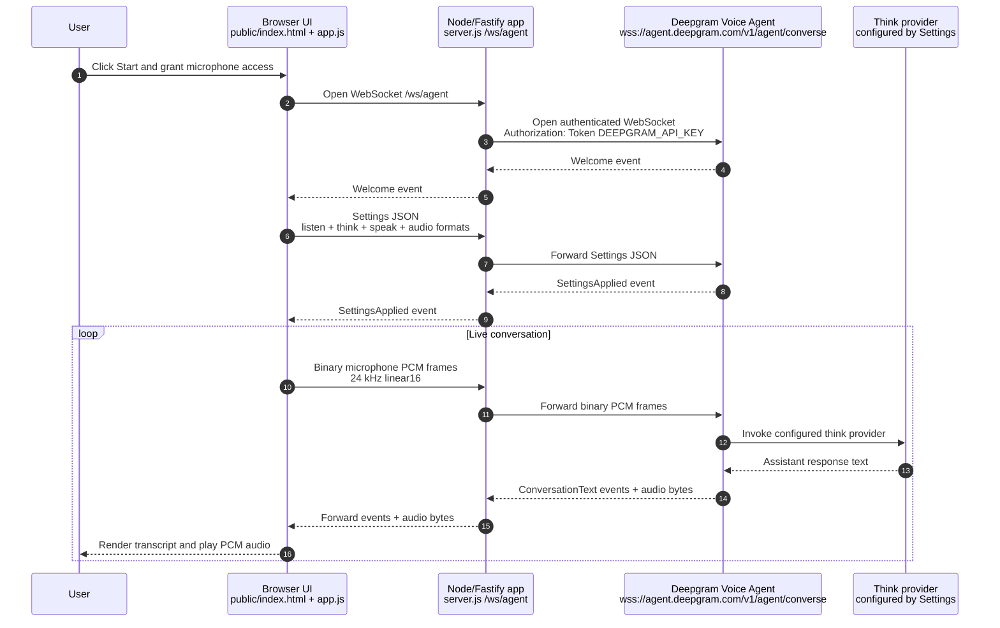

# Deepgram Voice Agent POC

A minimal browser + Node.js proof of concept for Deepgram's end-to-end Voice Agent API. The UI captures microphone audio, converts it to 24 kHz `linear16` PCM, streams it through a local WebSocket proxy, and plays Deepgram's streamed PCM responses.

## Architecture



### Integration points

| Integration point | Files | Responsibility | Configuration |
| --- | --- | --- | --- |
| Static web UI | `public/index.html`, `public/styles.css` | Presents the start/stop controls, agent settings, transcript, and raw event log. | User-editable prompt, greeting, LLM model, voice model, and language fields in the browser. |
| Browser audio pipeline | `public/app.js` | Requests microphone permission, downsamples mic input to 24 kHz, encodes `linear16` PCM, streams binary frames, and schedules streamed PCM playback. | `SAMPLE_RATE` is currently fixed at `24000` to match the default Deepgram settings. |
| Local WebSocket proxy | `server.js` | Accepts browser connections at `/ws/agent`, opens the Deepgram Voice Agent WebSocket, adds server-side auth, and forwards JSON and binary frames in both directions. | `DEEPGRAM_API_KEY`, `DEEPGRAM_AGENT_URL`, and `PORT` from `.env`. |
| Deepgram Voice Agent | External Deepgram platform | Performs speech-to-text/listen, turn-taking, agent orchestration, text-to-speech/speak, and event/audio streaming. | The browser sends the `Settings` message after receiving Deepgram's `Welcome` event. |
| Think/LLM provider | External provider configured through Deepgram settings | Generates the assistant's response text before Deepgram synthesizes the response audio. | Defaults to `open_ai` with `gpt-4o-mini`; update the UI fields or `buildSettings()` for other providers/models. |

### Current architecture: pros

- **Keeps project credentials out of the browser.** The Deepgram API key only lives in `.env` and is injected into the outbound server-side WebSocket request.
- **Small end-to-end surface area.** There is one static client, one proxy endpoint, and one Deepgram Voice Agent connection, which makes the POC easy to inspect and modify.
- **Supports realtime bidirectional media.** The same WebSocket path forwards both JSON control/events and binary PCM audio frames.
- **Fast local iteration.** Agent prompt, greeting, model, voice, and language can be adjusted in the UI without rebuilding the server.
- **Provider flexibility.** The Deepgram `Settings` payload is isolated in `buildSettings()`, so swapping Deepgram models, voices, or the think provider is straightforward.

### Current architecture: cons and tradeoffs

- **Not production-authenticated.** Any browser that can reach the local server can open `/ws/agent`; production deployments should add user auth, origin checks, rate limits, and abuse protection.
- **Browser audio implementation is POC-grade.** `ScriptProcessorNode` is simple but deprecated; an `AudioWorklet` is better for lower-latency, production-quality streaming.
- **Naive resampling.** The current downsampler prioritizes readability over audio fidelity. Production code should use a higher-quality resampler.
- **No reconnection or session recovery.** A dropped browser or Deepgram WebSocket ends the conversation and requires the user to start over.
- **Single-process proxy.** The Node server does not yet include horizontal scaling, sticky sessions, backpressure controls, or persistent conversation state.
- **Limited observability.** The UI shows raw events, but the server does not emit structured metrics, tracing, latency measurements, or audio pipeline diagnostics.

## Why a server proxy?

Deepgram's Voice Agent WebSocket requires authentication. Keeping `DEEPGRAM_API_KEY` on the server prevents exposing a project key in browser code. The browser connects to `/ws/agent`; `server.js` connects to `wss://agent.deepgram.com/v1/agent/converse` with `Authorization: Token ...`.

## Setup

```bash
npm install
cp .env.example .env
# edit .env and set DEEPGRAM_API_KEY
npm start
```

Open <http://localhost:3000>, allow microphone access, and click **Start conversation**.

## Environment variables

See `.env.example` for templates:

- `DEEPGRAM_API_KEY` — required Deepgram API key.
- `DEEPGRAM_AGENT_URL` — optional endpoint override. Defaults to `wss://agent.deepgram.com/v1/agent/converse`.
- `OPENAI_API_KEY` — optional placeholder for the LLM provider configured in Deepgram agent settings.
- `PORT` — optional local server port.

## Notes

- The default POC settings use Deepgram Flux for listening, OpenAI `gpt-4o-mini` for thinking, and Deepgram Aura 2 for speaking.
- The UI sends a `Settings` message after receiving Deepgram's `Welcome` event, then streams raw binary audio frames.
- This is intentionally lightweight POC code; for production, replace `ScriptProcessorNode` with an `AudioWorklet`, add auth for the local proxy, and harden reconnection/error handling.
